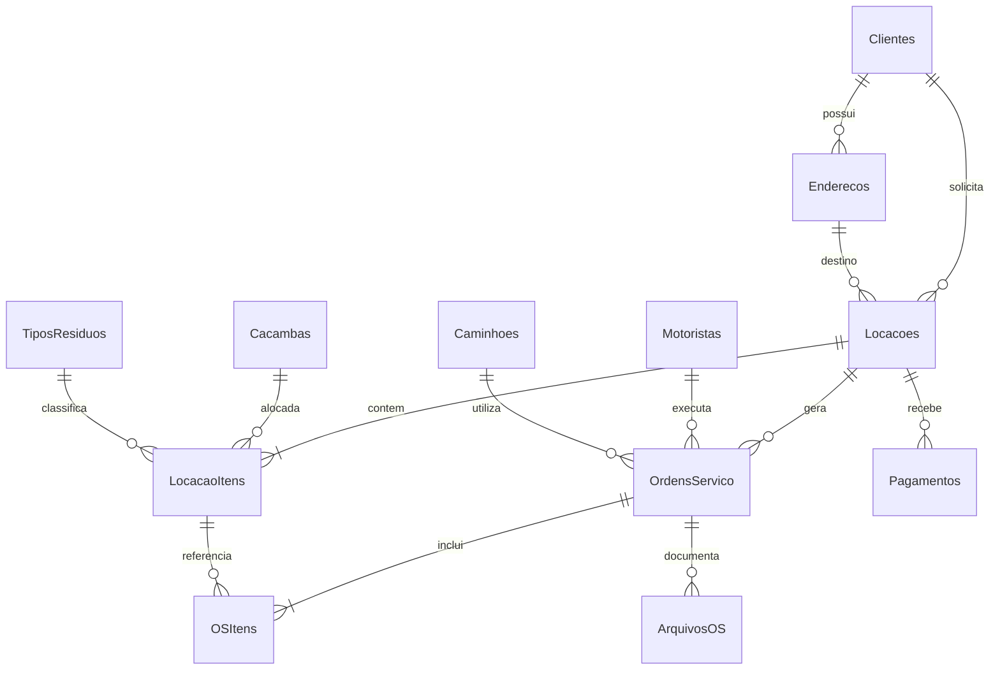

# Gestão de Locação de Caçambas — Google Apps Script

Aplicação web responsiva com Google Planilhas como banco, Drive para fotos/assinaturas/PDF e autorização por Conta Google.

### Correção 1.0.1

- converte datas da planilha antes de devolvê-las pelo `google.script.run`;
- exibe erro de inicialização no lugar de permanecer indefinidamente em “Carregando…”;
- aplica tempo limite de 30 segundos às chamadas da interface.

## O que está implementado

- três perfis: Administrador, Atendente e Motorista, validados no servidor;
- instalação automática das 16 abas e cabeçalhos;
- clientes PF/PJ, endereços e fotografia histórica do endereço na locação;
- validação dos dígitos de CPF/CNPJ, unicidade documental e validação de placa;
- caçambas, motoristas, caminhões, tipos de resíduo e configurações;
- locação com uma ou várias caçambas no modelo cabeçalho/itens;
- bloqueio de resíduo proibido;
- reserva concorrente de caçambas com `LockService`;
- taxa de deslocamento por rota Google ou distância manual justificada;
- prazo individual de 15 dias e diária excedente consolidada na retirada;
- pagamentos parciais em Pix/Dinheiro com chave de idempotência;
- ordens de entrega, retirada e troca;
- visão móvel do motorista restrita às próprias ordens;
- no mínimo duas fotos e assinatura desenhada para concluir serviço;
- arquivos organizados no Drive por ano, locação e OS;
- PDF final da OS;
- movimentações de caçamba e auditoria.

## Instalação

1. Crie um projeto independente em [script.google.com](https://script.google.com).
2. Crie os arquivos com os mesmos nomes deste pacote e cole o conteúdo. O arquivo `appsscript.json` é o manifesto.
3. Em **Configurações do projeto**, habilite a exibição do manifesto se necessário.
4. Execute no editor:

```javascript
instalarSistema('seu-email-google@dominio.com')
```

5. Autorize acesso ao Google Planilhas, Drive, Documentos e identidade do usuário.
6. Opcionalmente, conectado como administrador, execute `criarDadosDemonstracao()`.
7. Em **Implantar → Nova implantação → Aplicativo da Web**:
   - executar como: **usuário que acessa o app** quando a política do Workspace permitir; caso contrário, execute como proprietário, mantendo a lista `Usuarios` como controle obrigatório;
   - quem pode acessar: somente contas Google autorizadas pela organização, nunca acesso anônimo;
   - copie a URL `/exec`.

> A identificação por `Session.getActiveUser().getEmail()` pode ficar vazia fora de um Google Workspace ou em implantação anônima. Nesse caso, restrinja a implantação ao domínio ou às contas autorizadas. Não substitua essa regra por senha gravada na planilha.

## Primeiro uso

1. Abra a planilha gerada e complete `Configuracoes`: empresa, endereço-base e valor por km.
2. Cadastre usuários na aba `Usuarios`. Use exatamente: `Administrador`, `Atendente` ou `Motorista`; status `Ativo`.
3. Para motorista, preencha `MotoristaID` com o UUID do cadastro correspondente.
4. Cadastre caminhão e motorista, mantendo a associação 1:1 nos dois registros.
5. Cadastre tipos de resíduos e caçambas.
6. Abra a aplicação, cadastre cliente e endereço, crie e confirme a locação.
7. Crie as ordens usando os IDs da locação e de seus itens. O motorista concluirá pelo celular.

## Modelo de dados



## Matriz resumida de permissões

| Recurso | Administrador | Atendente | Motorista |
|---|---:|---:|---:|
| Configurações, usuários e cadastros críticos | Total | Não | Não |
| Clientes, endereços e locações | Total | Criar/consultar | Não |
| Valores e pagamentos | Total | Criar/consultar | Não |
| Criar/atribuir OS | Total | Sim | Não |
| Ver todas as OS | Total | Sim | Não |
| Ver/iniciar/concluir OS própria | Sim | Não | Sim |
| Fotos e assinatura | Sim | Consulta | OS própria |
| Auditoria e correção justificada | Total | Não | Não |

## Backup e restauração

- Faça cópia periódica da planilha e da pasta raiz no Drive.
- Antes de atualizar código, crie uma nova versão da implantação e preserve a anterior.
- Para restaurar código, escolha uma versão anterior em **Gerenciar implantações**.
- Para restaurar dados, use o histórico de versões da planilha ou uma cópia de backup.
- Nunca apague linhas referenciadas; altere o status para `Inativo` ou `Cancelado`.

## Limites e evolução segura

Esta versão é operacional, mas o Apps Script possui cotas de execução, Drive, Documentos e Maps. Fotos são comprimidas no navegador e limitadas a 6 MB no servidor. Para alto volume, considere armazenamento e banco dedicados.

A tela inicial permite uma caçamba por criação; o back-end já aceita várias em `itens[]`. Uma próxima evolução pode incluir editor visual com múltiplos itens, CRUD administrativo completo, rotas agrupadas, relatórios exportáveis e anexação de comprovante financeiro.
